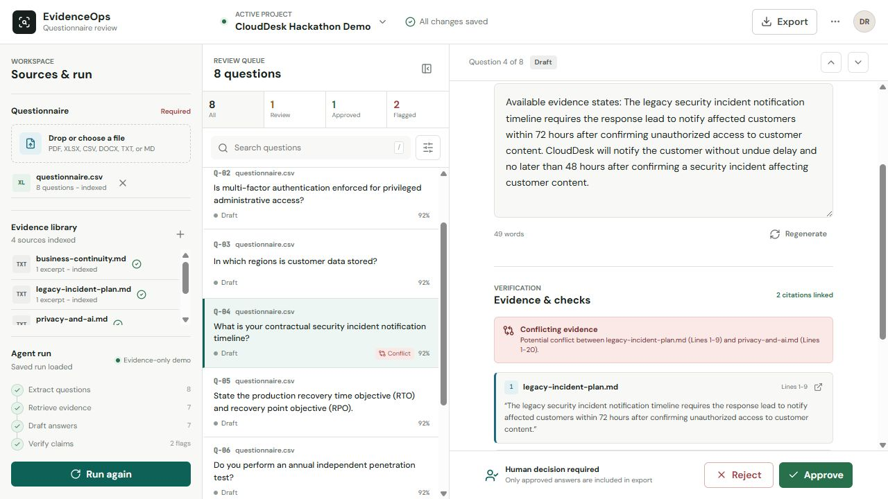

# EvidenceOps

**No evidence, no answer.** EvidenceOps turns security, compliance, and RFP questionnaires into cited answer drafts that a human can inspect, approve, and export.

A fluent but unsupported compliance answer creates risk. EvidenceOps uses the [Strands Agents SDK](https://strandsagents.com/) for grounded drafting, while deterministic application code retains control of source identity, contradiction checks, workflow state, and approval. Uploaded source material is evidence; model output is not.



## What the demo proves

The included synthetic CloudDesk run makes the trust boundary visible in one review queue:

- eight questionnaire items are extracted with their source locations;
- seven receive evidence-backed drafts with exact document quotes;
- a 48-hour versus 72-hour incident-notification conflict is surfaced instead of silently resolved;
- a missing subprocessor register remains an explicit evidence request, not an invented answer;
- editing an approved answer invalidates the old approval; and
- exports include only approved answers by default.

This project was created during the 2026 Agents for Humans Hackathon submission period for the **Professional Agents** track.

## Demo flow

1. Upload a PDF, XLSX, CSV, DOCX, Markdown, or text questionnaire.
2. Upload the approved evidence library.
3. Run the workflow to extract questions, retrieve evidence, draft answers, and check support and contradictions.
4. Review every item with its exact source, page or sheet, and quote.
5. Approve, edit, reject, or request missing evidence.
6. Export approved work as XLSX, CSV, or JSON.

The synthetic fixtures in `examples/` intentionally include grounded answers, a superseded source conflict, and evidence gaps. They make the complete workflow demonstrable without using customer data or an external model account.

## Quick start

Python 3.11 or newer is required.

```powershell
python -m venv .venv
.\.venv\Scripts\python.exe -m pip install -e ".[dev,mcp]"
.\.venv\Scripts\python.exe -m uvicorn evidenceops.api:app --host 127.0.0.1 --port 8000
```

Open `http://127.0.0.1:8000`. API documentation is at `http://127.0.0.1:8000/docs`.

On macOS or Linux, replace `.\.venv\Scripts\python.exe` with `.venv/bin/python`.

## Model configuration

No credentials are needed for the deterministic local demo. It drafts only from retrieved excerpts and marks weakly supported work for review.

To use an OpenAI-compatible endpoint:

```powershell
$env:EVIDENCEOPS_PROVIDER = "openai"
$env:OPENAI_COMPATIBLE_BASE_URL = "https://BASE_URL/v1"
$env:OPENAI_COMPATIBLE_API_KEY = "API_KEY"
$env:OPENAI_COMPATIBLE_MODEL = "MODEL_ID"
```

To use Amazon Bedrock through the Strands default model path:

```powershell
$env:EVIDENCEOPS_PROVIDER = "bedrock"
$env:AWS_REGION = "us-west-2"
$env:BEDROCK_MODEL_ID = "MODEL_ID"
```

`EVIDENCEOPS_PROVIDER=auto` selects the OpenAI-compatible adapter only when its server-side key is present; otherwise it uses the evidence-only deterministic demo provider. Select `bedrock` explicitly for Amazon Bedrock. The resilient wrapper applies request throttling, bounded retry, a circuit breaker, and deterministic fallback. Provider outages never turn into uncited answers.

Supported settings:

| Variable | Purpose | Default |
| --- | --- | --- |
| `EVIDENCEOPS_DATA_DIR` | SQLite data directory | `data` |
| `EVIDENCEOPS_PROVIDER` | `auto`, `openai`, `bedrock`, or `demo` | `auto` |
| `OPENAI_COMPATIBLE_BASE_URL` | OpenAI-compatible API root | `http://localhost:8001/v1` |
| `OPENAI_COMPATIBLE_API_KEY` | Provider credential | empty |
| `OPENAI_COMPATIBLE_MODEL` | Provider model ID | `MODEL_ID` |
| `AWS_REGION` | Bedrock region | `us-west-2` |
| `BEDROCK_MODEL_ID` | Bedrock model ID | configured placeholder |
| `EVIDENCEOPS_REQUESTS_PER_MINUTE` | Provider throttle | `30` |
| `EVIDENCEOPS_PROVIDER_RETRIES` | Transient retry count | `2` |
| `EVIDENCEOPS_CIRCUIT_FAILURE_THRESHOLD` | Failures before opening circuit | `3` |
| `EVIDENCEOPS_CIRCUIT_COOLDOWN_SECONDS` | Circuit cooldown | `30` |
| `EVIDENCEOPS_TOOL_CALLS_PER_MINUTE` | Per-tenant verification call limit | `60` |
| `EVIDENCEOPS_TOOL_CACHE_TTL_SECONDS` | Verification result cache TTL | `300` |

## API and restricted tool boundary

FastAPI, tests, and the optional MCP transport all call the same `EvidenceOpsService`; the evidence checks are not coupled to the web interface.

Core endpoints:

- `POST /api/projects`
- `POST /api/projects/{project_id}/documents?kind=questionnaire|evidence`
- `POST /api/projects/{project_id}/run`
- `PATCH /api/projects/{project_id}/questions/{question_id}/review`
- `GET /api/projects/{project_id}/missing-evidence`
- `GET /api/projects/{project_id}/export?format=xlsx|csv|json&include_drafts=false`
- `POST /api/tools/verify-evidence`

The last endpoint is a fixed business action, not a chat or arbitrary-prompt proxy. It requires a tenant identifier, a tenant-scoped project id, a question, a proposed answer, and structured citations. Every citation must match stored evidence in that project before it can be marked verified. The endpoint returns grounding, hallucination risk, contradictions, unsupported claims, citation integrity, cache status, and a request ID. Tenant-level call limits and metadata-only audit records apply. Provider credentials, model access, and generic prompt forwarding are never exposed. The same fixed operation is available through the optional MCP adapter:

```powershell
.\.venv\Scripts\python.exe -m evidenceops.mcp_server
```

Both transports reuse the same deterministic verification service. They do not bypass the human approval workflow or invoke the internal model provider.

## Tests

```powershell
.\.venv\Scripts\python.exe -m pytest
.\.venv\Scripts\python.exe -m pytest --cov=evidenceops --cov-report=term-missing
```

`tests/test_strands_integration.py` is a credential-free contract test that starts a local
OpenAI-compatible endpoint, invokes the real Strands `Agent` and `OpenAIModel`, exercises the
typed `AgentDraft` tool call, and runs the result through retrieval and grounding in
`EvidenceOpsService`. It proves the SDK integration without claiming that a third-party model
or Bedrock account was used. See `docs/runtime-validation.md` for the recorded versions and gate.

## Repository map

```text
src/evidenceops/   API, parsers, retrieval, provider adapters, service, storage
web/               Responsive review workspace
tests/             Parser, provider, workflow, API, and grounding tests
examples/          Synthetic questionnaire and evidence fixtures
docs/              Architecture, Devpost copy, demo script, and delivery template
```

## Submission and deployment notes

- The local build stores run state and citation spans in SQLite.
- The AWS deployment path maps files to S3, workflow state to DynamoDB, retrieval to OpenSearch or Bedrock Knowledge Bases, and the Strands runtime to AgentCore or a container service. See `docs/architecture.md`.
- `docs/hackathon-compliance.md` records the official rule check and outstanding user-owned submission actions.
- Public repository: https://github.com/FranklinNexus/evidenceops-agent
- Final Devpost submission, eligibility confirmation, AWS identity actions, and any paid deployment remain project-owner actions.

## Scope

This MVP assists document preparation. It is not a certification, audit opinion, or legal determination. Production use additionally requires tenant isolation, authentication and roles, malware scanning, retention controls, secrets management, immutable audit logging, and a documented data-processing agreement.

## License

[MIT](LICENSE)
