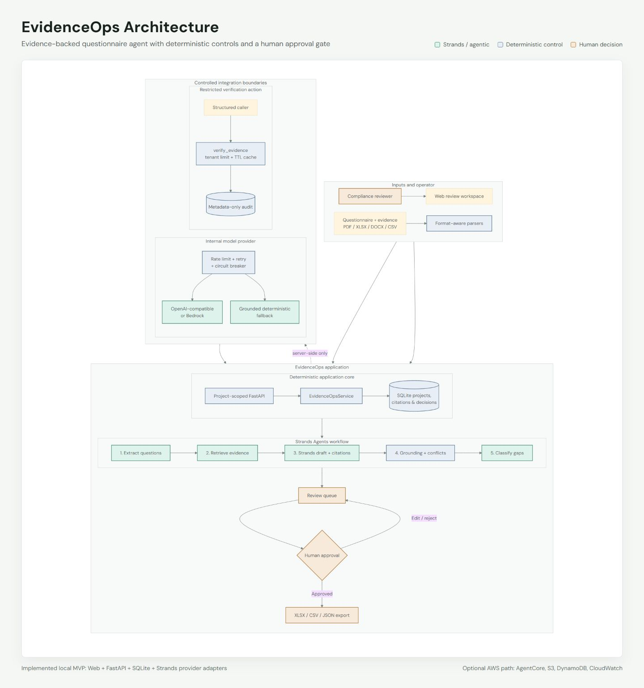
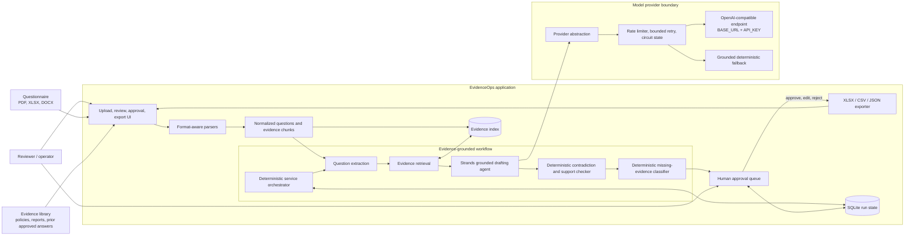
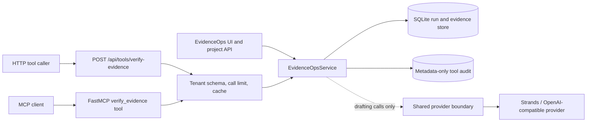
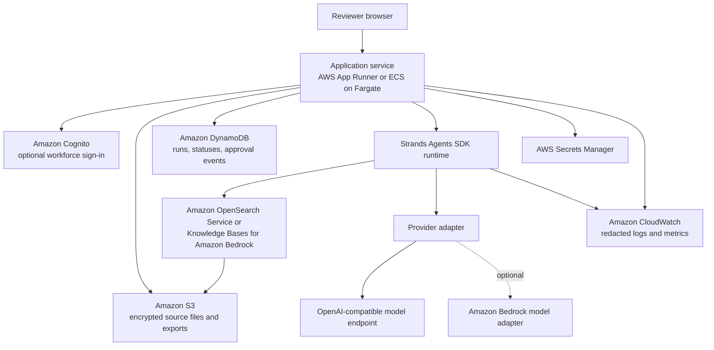

# EvidenceOps MVP Architecture

## Scope and design intent

EvidenceOps is a human-reviewed assistant for compliance and RFP questionnaires. The MVP turns uploaded questionnaires and an organization-provided evidence library into reviewable answer drafts. It does not create evidence, infer certifications, or auto-submit answers.

The trust boundary is simple: source documents supplied by the operator are evidence; model output is not. Every answer must either cite retrievable source material or remain visibly blocked for missing evidence.

## End-to-end flow

## Processing contract

1. **Ingest.** Parse PDF, XLSX, and DOCX questionnaire files and evidence files while retaining source name, location, and extraction metadata.
2. **Extract and normalize.** Turn questionnaire rows, paragraphs, and prompts into traceable question records while preserving the original question and source location.
3. **Retrieve.** Search only the uploaded evidence library. Return source identifiers and locators with each excerpt.
4. **Draft.** Produce a concise proposed answer constrained by retrieved excerpts. A weak or absent basis produces a missing-evidence result, not an invented claim.
5. **Verify.** Compare each claim against its cited excerpts, flag unsupported language, and surface conflicts between sources.
6. **Classify gaps.** Create an actionable missing-evidence item tied to the unanswered question.
7. **Approve.** Require a person to approve, edit, or reject every draft. The current decision and reviewer note persist in run state; a later edit clears approval.
8. **Export.** Produce XLSX, CSV, or JSON rows with answers, status, citations, gaps, and reviewer notes. Only approved rows are included by default.

## Core records

| Record | Required fields | Invariant |
| --- | --- | --- |
| `DocumentRecord` | document ID, project ID, filename, type, chunk count | Original source identity is retained after parsing. |
| `EvidenceChunk` | chunk ID, source ID, locator, text | A citation resolves to an actual extracted span. |
| `QuestionRecord` | question ID, original text, source location, answer, citations, checks, status, note | Draft text cannot transition to approved without the review endpoint. |
| `EvidenceChecks` | grounded flag, hallucination risk, unsupported claims, contradictions | Checks remain attached to the question during review and export. |
| `ToolAudit` | tenant, request ID/hash, action, cache use, outcome, timestamp | The restricted tool audit excludes prompt text and credentials. |

## Strands Agents SDK mapping

Strands owns the model-assisted drafting call. Deterministic application code owns workflow order, file parsing, retrieval, citation identity, verification, state transitions, approval gates, and exports.

| EvidenceOps concern | Strands pattern | Boundary |
| --- | --- | --- |
| Workflow coordination | `EvidenceOpsService` calls each stage in a fixed order | The model cannot skip verification or approval. |
| Question extraction | Format-aware deterministic parsers | Original question text and locator are retained. |
| Evidence retrieval | Local term-weighted retrieval | The agent receives only selected excerpts and locators. |
| Draft generation | Strands `Agent` with typed `AgentDraft` structured output | Output contains answer text plus valid citation indexes. |
| Verification | Deterministic support, numeric-claim, and conflict checks | Findings quote the relevant source spans. |
| Missing-evidence routing | Deterministic status and request description | Status is based on retrieval and support checks, not model confidence. |
| Observability | Provider name, request IDs, statuses, and metadata-only tool audit | Secrets and full sensitive documents are excluded from audit rows. |
| Model access | Provider adapter used by the Strands model boundary | The domain workflow does not depend on one provider's request schema. |

Keeping the drafting contract narrow makes model behavior inspectable and permits provider substitution without rewriting the evidence or approval layers.

## Structured HTTP tool entry and MCP adapter

EvidenceOps exposes one narrow verification capability for structured tool callers. This is a transport adapter over the existing application service, not another workflow.

The HTTP entry accepts a structured object:

| Field | Type | Purpose |
| --- | --- | --- |
| `tenant_id` | constrained string | Tenant scope used for limits, cache separation, and project checks |
| `request_id` | optional string | Caller correlation ID; generated when omitted |
| `question` | string | The requirement being answered |
| `answer` | string | The answer text to verify |
| `citations` | array of `{document, page_or_sheet, quote}` | Exact source spans claimed as support |
| `project_id` | optional string | When present, verify each citation against stored project evidence |

It returns `tenant_id`, `request_id`, `cached`, `grounded`, `hallucination_risk`, `unsupported_claims`, `contradictions`, and per-citation integrity results. Repeated calls use a tenant-separated TTL cache; calls are limited per tenant, and the audit table records only identifiers, the request hash, cache use, outcome, and timestamp. It does not store prompts or provider credentials in the audit record.

The optional MCP server exposes the same inputs as a `verify_evidence` tool and delegates directly to `EvidenceOpsService.verify_evidence`. It is built through the same application factory, so it reuses the configured store, settings, provider construction, citation rules, and failure semantics. Verification itself is deterministic and does not invoke a model. Provider-specific calls used elsewhere for drafting continue through the existing provider abstraction; the MCP adapter does not call a model endpoint directly.

The adapter is intentionally limited to verification. Upload, questionnaire execution, human review, and export remain in the existing application flow and approval boundary. Adding another transport therefore does not create a second agent, duplicate business logic, or bypass the human gate.

The OpenAI-compatible provider is server-side infrastructure only. The application does not issue model keys, accept arbitrary prompts, expose generic chat completion routes, or proxy downstream callers to the provider. The default demo uses synthetic fixtures and the deterministic provider; any non-demo provider load requires separate confirmation by the operator and provider owner.

## Provider resilience

The MVP reads provider configuration from environment variables such as `BASE_URL`, `API_KEY`, and model identifiers. Secrets are never accepted as document evidence or written to exports.

The provider adapter applies:

- sliding-window request throttling;
- bounded exponential retry delays for transient failures;
- a circuit state to avoid repeatedly calling an unhealthy endpoint; and
- an evidence-only deterministic fallback.

After a provider failure, the fallback may draft only by quoting retrieved evidence. If retrieval has
no evidence, the question stays in `NEEDS_EVIDENCE`. The selected provider or fallback is recorded on
the question without logging credentials; the application never invents a plausible answer to hide an outage.

## Human approval and safety properties

- No questionnaire answer is export-ready until a reviewer explicitly approves it.
- Editing a draft after approval invalidates the prior approval.
- Citation locators remain attached to the answer during review and export.
- A reviewer can reject a draft, mark a source obsolete, or resolve a conflict with a note.
- Retrieval failure, parser failure, or model failure remains visible at item level.
- The MVP assists document preparation; it is not a compliance certification, legal opinion, or autonomous submission system.

## AWS deployment mapping

The local MVP is intentionally runnable with local storage and an OpenAI-compatible endpoint. The following mapping is a deployment path, not a claim that every managed service is present in the local demo.

| Local MVP capability | AWS-oriented deployment option | Reason |
| --- | --- | --- |
| Local upload directory | Amazon S3 with versioning and SSE-KMS | Durable, access-controlled source and export storage |
| In-process run state | Amazon DynamoDB | Durable workflow and approval records |
| Local evidence index | OpenSearch Service or Bedrock Knowledge Bases | Managed retrieval at larger corpus sizes |
| Local application process | App Runner or ECS on Fargate | Straightforward container hosting for parser-heavy workloads |
| Environment-file secrets | Secrets Manager | Rotation and runtime access control |
| Application logs | CloudWatch Logs and metrics | Operational visibility with redaction controls |
| OpenAI-compatible provider | Same adapter, or a Bedrock-specific adapter | Provider portability without changing domain records |
| In-app reviewer identity | Cognito and application roles | Attributable approval events |

For a production deployment, add tenant isolation, malware scanning on upload, encryption-key policy, retention controls, backups, regional data handling, SSO/RBAC, audit-log immutability, and a documented incident process. Those controls are outside the MVP claim.

## Failure behavior

| Failure | User-visible outcome | Data behavior |
| --- | --- | --- |
| Unsupported or damaged file | File-level parse error | Other valid files remain available. |
| No relevant evidence | `NEEDS_EVIDENCE` with a specific request | No answer is inferred from general model knowledge. |
| Conflicting evidence | Conflict finding with both citations | Approval requires a reviewer disposition note. |
| Provider throttling/outage | Bounded retry, then deterministic evidence-only fallback | Existing work is retained and the fallback provider is recorded. |
| Partial workflow failure | Completed item results plus failed-item status | Run can be inspected without presenting partial work as complete. |
| Reviewer changes draft | Approval is cleared | New text requires approval again. |

## MVP boundaries

The demonstrable MVP focuses on a single review workspace, common office-document ingestion, cited drafting, findings, human approval, and export. Enterprise identity, multi-tenant isolation, source-system connectors, signature workflows, full policy lifecycle management, and compliance-framework certification are future work.
